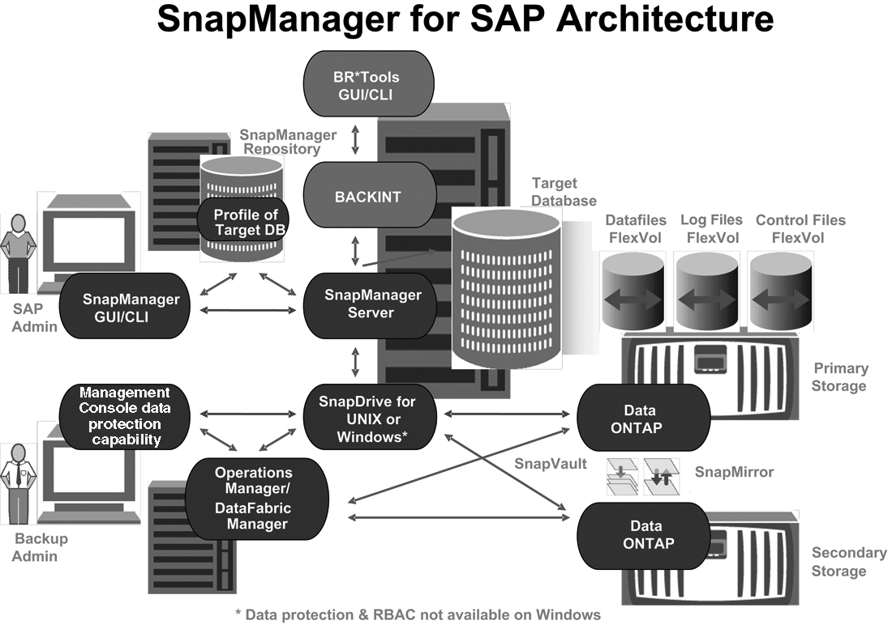

= 운영 및 2차 스토리지 구성 및 토폴로지
:allow-uri-read: 
:icons: font
:imagesdir: ../media/

[role="lead"]
이 예에서 TechCo 법인은 급여 데이터베이스를 SAP 호스트용 SnapManager인 데이터베이스 서버에서 실행하고 급여 데이터베이스 데이터 및 구성 파일을 회사 본사의 기본 스토리지 시스템에 저장합니다. 본사의 요구사항은 로컬 스토리지에 매일 그리고 매주 백업을 수행하고 50마일 떨어진 보조 스토리지 사이트에 있는 스토리지 시스템에 백업을 수행하여 데이터베이스를 보호하는 것입니다.

다음 그림에서는 로컬 및 보조 백업 보호를 지원하는 데 필요한 SAP용 SnapManager와 NetApp 관리 콘솔 데이터 보호 기능 구성 요소를 보여 줍니다.

이전 그래픽에 설명된 대로 급여 데이터베이스를 관리하고 로컬 및 보조 백업 보호를 지원하려면 다음 구축이 사용됩니다.

* * SnapManager 호스트 *
+
SnapManager 호스트 payroll.techco.com 는 회사 본사에 있으며 UNIX 서버에서 실행되며, 급여 데이터베이스를 생성하고 유지 관리하는 데이터베이스 프로그램도 실행합니다.

+
** * 연결 *
+
로컬 백업 및 보조 백업 보호를 지원하기 위해 SnapManager 호스트에는 다음 구성 요소에 대한 네트워크 연결이 있습니다.

+
*** SAP 클라이언트용 SnapManager
*** 데이터베이스 프로그램을 실행하는 SnapManager 저장소, UNIX용 SnapDrive 및 SnapManager
*** 지원합니다
*** 2차 스토리지 시스템
*** DataFabric Manager 서버입니다

** * 설치된 제품 *
+
SnapManager 호스트는 이 예에 대해 다음 제품과 함께 설치됩니다.

+
*** SnapManager 서버
*** UNIX용 SnapDrive
*** Host Utilities(호스트 유틸리티)

* * TechCo 운영 스토리지 시스템 *
+
연결된 데이터 파일, 로그 파일 및 제어 파일을 비롯한 급여 데이터베이스는 기본 스토리지 시스템에 상주합니다. 이들은 TechCo 회사 본사와 함께 SnapManager 호스트 및 운영 스토리지와 SnapManager 호스트를 연결하는 네트워크에 있습니다. 최신 급여 데이터베이스 트랜잭션 및 업데이트는 기본 스토리지 시스템에 기록됩니다. 급여 데이터베이스의 로컬 백업 보호를 제공하는 Snapshot 복사본도 기본 스토리지 시스템에 있습니다.

+
** * 연결 *
+
보조 백업 보호를 지원하기 위해 운영 스토리지 시스템은 다음 구성 요소에 대한 네트워크 연결을 지원합니다.

+
*** 데이터베이스 프로그램을 실행하는 SnapManager 호스트, UNIX용 SnapDrive 및 SnapManager
*** 2차 스토리지 시스템
*** DataFabric Manager 서버입니다

** * 설치된 제품 *
+
이 예에서는 이러한 시스템에서 다음 라이센스를 활성화해야 합니다.

+
*** Data ONTAP 7.3.1 이상
*** SnapVaultData ONTAP 기본
*** FlexVol(NFS에 필요)
*** SnapRestore
*** NFS 프로토콜

* * TechCo 보조 스토리지 시스템 *
+
50마일 떨어진 네트워크에 연결된 2차 스토리지 사이트에 위치한 2차 스토리지 시스템은 급여 데이터베이스의 2차 백업을 저장하는 데 사용됩니다.

+
** * 연결 *
+
보조 백업 보호를 지원하기 위해 보조 스토리지 시스템은 다음 구성 요소에 대한 네트워크 연결을 지원합니다.

+
*** 지원합니다
*** DataFabric Manager 서버입니다

** * 설치된 제품 *
+
이 예에서는 보조 스토리지 시스템에서 다음 라이센스를 설정해야 합니다.

+
*** Data ONTAP
*** SnapVaultData ONTAP 보조
*** SnapRestore
*** FlexVol(NFS에 필요)
*** NFS 프로토콜

* * DataFabric Manager 서버 *
+
DataFabric Manager 서버인 techco_DFM 은 회사 본사에 있으며 스토리지 관리자가 액세스할 수 있는 위치에 있습니다. DataFabric Manager 서버는 다른 기능 중에서도 운영 스토리지와 보조 스토리지 간의 백업 작업을 조정합니다.

+
** * 연결 *
+
보조 백업 보호를 지원하기 위해 DataFabric Manager 서버는 다음 구성 요소에 대한 네트워크 연결을 유지합니다.

+
*** NetApp 관리 콘솔과 직접 연결되어 있습니다
*** 지원합니다
*** 2차 스토리지 시스템

** * 설치된 제품 *
+
DataFabric Manager 서버는 이 예에 대해 다음 서버 제품에 대해 라이센스가 부여됩니다.

+
*** DataFabric 관리자

* * SnapManager 리포지토리 *
+
전용 서버에 있는 SnapManager 리포지토리는 백업 시간, 테이블스페이스 및 데이터 파일 백업 시간, 사용된 스토리지 시스템, 만든 클론, 생성된 스냅샷 복사본 등 SnapManager에서 수행하는 작업에 대한 데이터를 저장합니다. DBA가 전체 또는 부분 복원을 시도할 때 SnapManager는 리포지토리를 쿼리하여 복구를 위해 SnapManager에서 생성한 백업을 식별합니다.

+
** * 연결 *
+
보조 백업 보호를 지원하기 위해 보조 스토리지 시스템은 다음 구성 요소에 대한 네트워크 연결을 지원합니다.

+
*** SnapManager 호스트
*** SAP 클라이언트용 SnapManager

* * NetApp 관리 콘솔 *
+
NetApp 관리 콘솔은 스토리지 관리자가 일정, 정책, 데이터 세트 및 리소스 풀 할당을 구성하여 스토리지 관리자가 액세스할 수 있는 보조 스토리지 시스템에 백업할 수 있도록 하는 그래픽 사용자 인터페이스 콘솔입니다.

+
** * 연결 *
+
보조 백업 보호를 지원하기 위해 NetApp Management Console은 다음 구성 요소에 대한 네트워크 연결을 제공합니다.

+
*** 지원합니다
*** 2차 스토리지 시스템
*** DataFabric Manager 서버입니다

* SAP 클라이언트용 * SnapManager
+
SAP용 SnapManager 클라이언트는 DBA가 급여 데이터베이스에 사용하는 그래픽 사용자 인터페이스 및 명령줄 콘솔로, 이 예에서는 보조 스토리지에 로컬 백업 및 백업을 구성하고 수행합니다.

+
** * 연결 *
+
로컬 백업 및 보조 백업 보호를 지원하기 위해 SnapManager for SAP Client에는 다음 구성 요소에 대한 네트워크 연결이 있습니다.

+
*** SnapManager 호스트
*** 데이터베이스 프로그램을 실행하는 SnapManager 저장소, UNIX용 SnapDrive 및 SnapManager
*** 데이터베이스 호스트(SnapManager를 실행하는 호스트와 분리된 경우)
*** DataFabric Manager 서버입니다

** * 설치된 제품 *
+
로컬 백업 및 보조 백업 보호를 지원하려면 이 구성 요소에 SAP용 SnapManager 클라이언트 소프트웨어가 설치되어 있어야 합니다.

